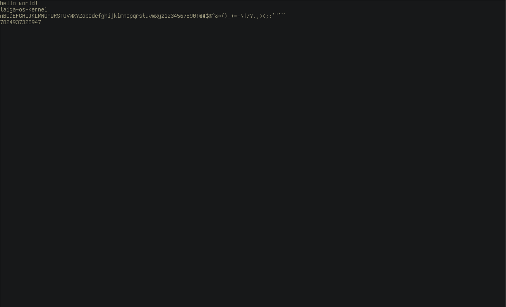

#  Taiga OS - a simple operating system
<p align="center">


</p>

```
  /\    Taiga os
  /\    description: this is a simple operating system writen completely in rust  
 /__\   from scratch with no external libraries
 /  \   writen by: Ido Messenberg
/____\  
  ||
```
## features 🐈
* [x] custom x86_64 UEFI bootloader
* [ ] a simple shell
## how to build
* rust compiler
* qemu

1. install rust targets   `rustup target add x86_64-unknown-uefi` and
    `rustup target add x86_64-unknown-none`
2. build the the operating system `./batch/build` and `d`
3. run `./batch/run`

## current progress


## bugs
* efi status is u32  and not usize even though it needs to be usize because it brakes the load file function and it won't work
* can not get a correct memory map 